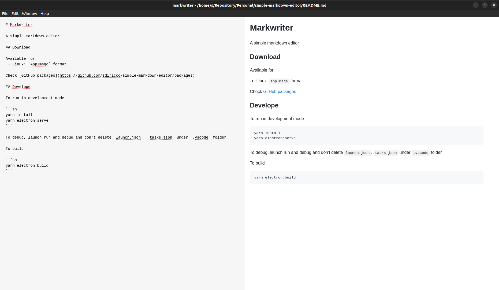

# Markwriter

A simple markdown editor



## Download

[Download here](https://github.com/sdiricco/simple-markdown-editor/releases/tag/1.0.2) the latest version, v1.0.2.

Available for [Linux](https://github.com/sdiricco/simple-markdown-editor/releases/tag/1.0.2) and [Windows](https://github.com/sdiricco/simple-markdown-editor/releases/tag/1.0.2)


## Develope

To run in development mode

```sh
yarn install
yarn electron:serve
```

To debug, launch run and debug and don't delete `launch.json`, `tasks.json` under `.vscode` folder

To build

```sh
yarn electron:build
```


