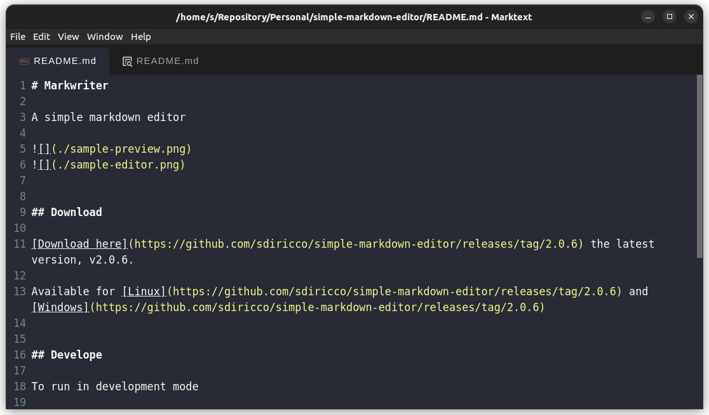

# Markwriter

A simple markdown editor





## Download

[Download here](https://github.com/sdiricco/simple-markdown-editor/releases/tag/2.0.9) the latest version, v2.0.9.

Available for [Linux](https://github.com/sdiricco/simple-markdown-editor/releases/tag/2.0.9) and [Windows](https://github.com/sdiricco/simple-markdown-editor/releases/tag/2.0.9)


## Develope

To run in development mode

```sh
yarn install
yarn electron:serve
```

To debug, launch run and debug and don't delete `launch.json`, `tasks.json` under `.vscode` folder

To build

```sh
yarn electron:build
```


